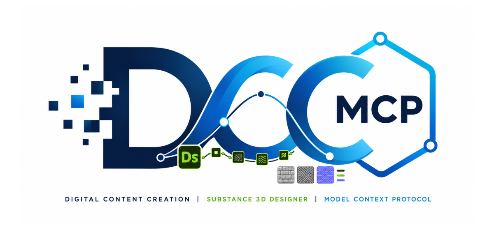

# dcc-mcp-substance3d-designer

<p align="center">
  
</p>

## Agent workflow

AI agents should use the shared gateway through `dcc-mcp-cli`; IDE users may
continue to use the MCP endpoint. Prefer typed skills and tools over raw scripts.

### Install or update the CLI

`dcc-mcp-cli` is the preferred control path for every shell-capable agent. If
it is missing, ask the user before installing the latest official release:

```bash
# Linux/macOS
curl -fsSL https://raw.githubusercontent.com/dcc-mcp/dcc-mcp-core/main/scripts/install-cli.sh | sh

# Windows PowerShell
powershell -ExecutionPolicy Bypass -c "irm https://raw.githubusercontent.com/dcc-mcp/dcc-mcp-core/main/scripts/install-cli.ps1 | iex"
```

Keep an official build current through the release manifest:

```bash
dcc-mcp-cli update check
dcc-mcp-cli update apply
```

`update apply` downloads and stages the latest CLI for the next launch. It
does not update a running `dcc-mcp-server`; update that server in its own
environment.

```bash
dcc-mcp-cli dcc-types
dcc-mcp-cli list
dcc-mcp-cli search --query "<task>" --dcc-type substance3d_designer
dcc-mcp-cli describe <tool-slug>
dcc-mcp-cli call <tool-slug> --json '{"key":"value"}'
```

`dcc-types` reports release-catalog support; `list` reports live sessions. If a
tool belongs to an inactive progressive skill, call `dcc-mcp-cli load-skill <skill-name> --dcc-type substance3d_designer` before retrying. For post-task improvement,
attach a stable session id with `--meta-json`, query `dcc-mcp-cli stats --range 24h --session-id <task-id>`, then pass the bounded evidence to the
`review_skill_improvement` prompt from `dcc-mcp-skills-creator`.


Substance 3D Designer adapter for the DCC Model Context Protocol (MCP).

The package runs an embedded Streamable HTTP MCP server inside Designer, so
tools execute through Designer's Qt main thread instead of a separate process.

## Install and load

Install this package with the Python environment used by Substance 3D Designer:

```bash
python -m pip install dcc-mcp-substance3d-designer
```

For unattended startup, append the installed package's
`dcc_mcp_substance3d_designer/designer/plugins` directory to
`SBS_DESIGNER_PYTHON_PATH`. Designer discovers the dedicated
`dcc_mcp_substance3d_designer_plugin` module without scanning the adapter's
implementation modules as plugins.

For an interactive installation, open **Tools > Plugin Manager**, browse to
`dcc_mcp_substance3d_designer/designer_plugin.py`, then load the plugin. Each
adapter instance uses an OS-assigned port and registers it for CLI discovery.
Connect through the stable gateway at `http://127.0.0.1:9765/mcp`; set
`DCC_MCP_SUBSTANCE3D_DESIGNER_PORT` only when a fixed direct endpoint is required.
Standard `DCC_MCP_GATEWAY_PORT` and `DCC_MCP_REGISTRY_DIR` settings are also honoured.

For unattended launches, pass Designer a persistent configuration with
`--config-file <path-to-default_configuration.sbscfg>`. This prevents a stale
session-specific configuration reference from opening a blocking startup
dialog.

## Bundled skills

`designer-session` provides typed tools for inspecting the active Designer
session and creating a rendered procedural PBR material package. Host APIs are
imported only while a tool runs, so metadata discovery remains safe outside
Designer.

## Development

```bash
python -m pip install -e ".[dev]"
python -m pytest
ruff check src tests tools
python -m build
```

Releases use release-please. The `release.yml` workflow publishes through the
`pypi` environment using PyPI Trusted Publishing.
