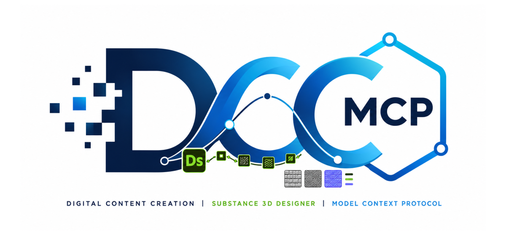
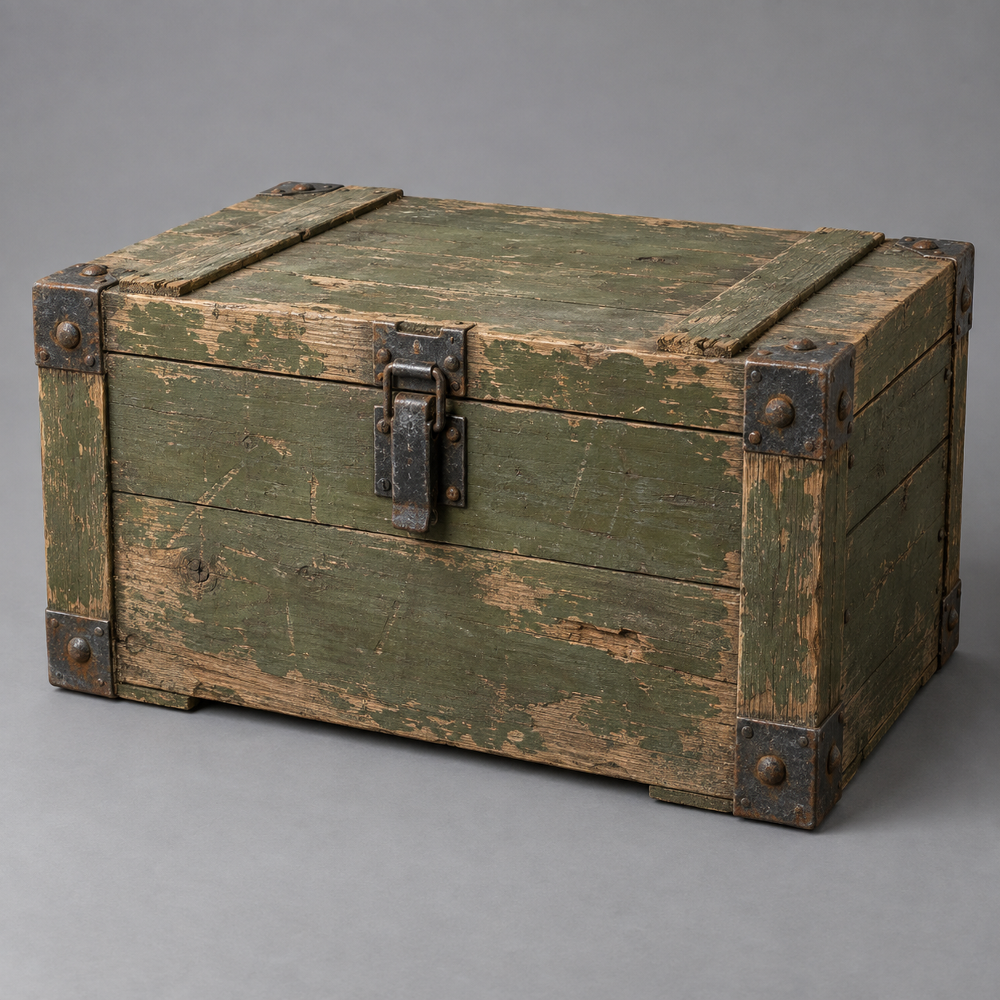
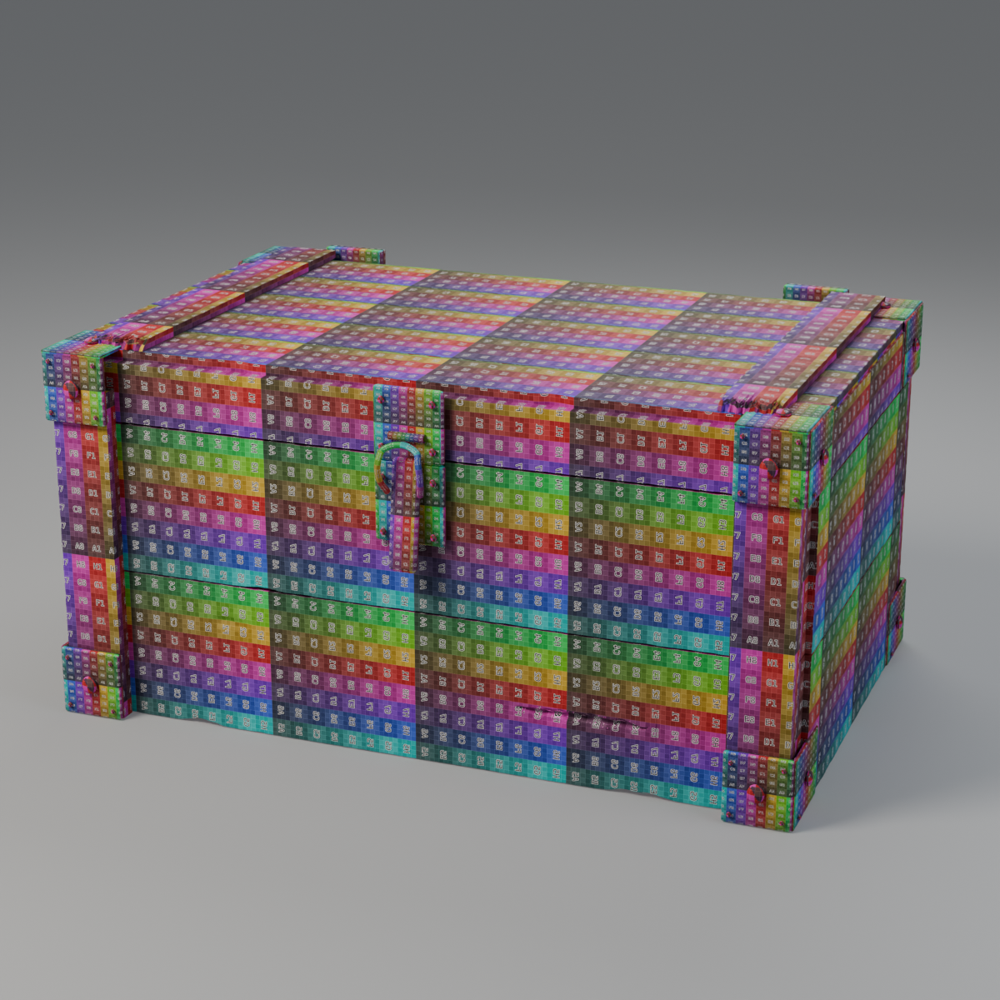

# dcc-mcp-substance3d-designer

<p align="center">
  
</p>

## Showcase: reference image to Designer materials and Blender lookdev

A Codex-generated reference guided a **2.2 m wooden crate modeled in Blender**
with painted wood and rusted steel authored in **Substance 3D Designer 16**.
Wood scratches, metal scratches and rust are independent procedural layers in
the SD graphs. Their exported PBR maps drive the Blender materials. Layered
broken battens combine attached wood fibers with native SD height displacement;
fine wood grain uses a separate UV layer with consistent physical density.

| Codex-generated reference | Blender Cycles render using SD maps |
| --- | --- |
|  |  |

**Model UVs — coordinates and a rendered checker:**

| UV coordinates | Checker on the model |
| --- | --- |
|  |  |

Wood detail uses one tile per 0.45 m. UVs intentionally tile and overlap;
the [UV review](docs/showcase/crate-lookdev/README.md#geometry-displacement-and-uvs)
explains the two layers and the existing steel UVs.

**Complete material graphs — unretouched Designer screenshots:**

| Painted wood: 37 nodes | Rusted steel: 35 nodes |
| --- | --- |
|  |  |

[Blender scene with packed textures](docs/showcase/crate-lookdev/crate.blend) ·
[Editable SBS, SBSAR, maps and workflow](docs/showcase/crate-lookdev/README.md) ·
[UV checker](docs/showcase/crate-lookdev/uv-checker.png) ·
[Broken wood detail](docs/showcase/crate-lookdev/detail.png) ·
[Blender showcase](https://github.com/dcc-mcp/dcc-mcp-blender/tree/main/docs/showcase/crate-lookdev) ·
[Website gallery](https://dcc-mcp.github.io/showcase) ·
[Earlier color-correction study](docs/showcase/painted-wood/README.md)

The crate is a reference-guided modeling and lookdev study. Its proportions,
board UVs and hardware were authored in Blender; it is not a scan of the
generated image. The material screenshots use the project's DCC-CUA route.

## Agent workflow

AI agents should use the shared gateway through `dcc-mcp-cli`; IDE users may
continue to use the MCP endpoint. Prefer typed skills and tools over raw scripts.

### Install or update the CLI

`dcc-mcp-cli` is the preferred control path for every shell-capable agent. If
it is missing, ask the user before installing the latest official release:

```bash
# Linux/macOS
curl -fsSL https://raw.githubusercontent.com/dcc-mcp/dcc-mcp-core/main/scripts/install-cli.sh | sh

# Windows PowerShell
powershell -ExecutionPolicy Bypass -c "irm https://raw.githubusercontent.com/dcc-mcp/dcc-mcp-core/main/scripts/install-cli.ps1 | iex"
```

Keep an official build current through the release manifest:

```bash
dcc-mcp-cli update check
dcc-mcp-cli update apply
```

`update apply` downloads and stages the latest CLI for the next launch. It
does not update a running `dcc-mcp-server`; update that server in its own
environment.

```bash
dcc-mcp-cli dcc-types
dcc-mcp-cli list
dcc-mcp-cli search --query "<task>" --dcc-type substance3d_designer
dcc-mcp-cli describe <tool-slug>
dcc-mcp-cli call <tool-slug> --json '{"key":"value"}'
```

`dcc-types` reports release-catalog support; `list` reports live sessions. If a
tool belongs to an inactive progressive skill, call `dcc-mcp-cli load-skill <skill-name> --dcc-type substance3d_designer` before retrying. For post-task improvement,
attach a stable session id with `--meta-json`, query `dcc-mcp-cli stats --range 24h --session-id <task-id>`, then pass the bounded evidence to the
`review_skill_improvement` prompt from `dcc-mcp-skills-creator`.


Substance 3D Designer adapter for the DCC Model Context Protocol (MCP).

The package runs an embedded Streamable HTTP MCP server inside Designer, so
tools execute through Designer's Qt main thread instead of a separate process.

## Install and load

Follow the canonical [Install SOP](install.md) for automatic host discovery, a zero-write plan,
staged installation, receipt-owned uninstall, and verify-to-usable diagnostics:

```bash
python3.11 -m pip install dcc-mcp-substance3d-designer
dcc-mcp-substance3d-designer install --dcc-path "/path/to/Designer" --python python3.11 --json --dry-run
dcc-mcp-substance3d-designer install --dcc-path "/path/to/Designer" --python python3.11 --json --yes
```

The receipted launcher preserves existing `SBS_DESIGNER_PYTHON_PATH` and `PYTHONPATH` values while
adding the dedicated plugin. A source checkout may still be loaded interactively through **Tools >
Plugin Manager** as documented in the SOP. Each adapter instance uses an OS-assigned port and
registers it for CLI discovery.
Connect through the stable gateway at `http://127.0.0.1:9765/mcp`; set
`DCC_MCP_SUBSTANCE3D_DESIGNER_PORT` only when a fixed direct endpoint is required.
Standard `DCC_MCP_GATEWAY_PORT` and `DCC_MCP_REGISTRY_DIR` settings are also honoured.

For unattended launches, pass Designer a persistent configuration with
`--config-file <path-to-default_configuration.sbscfg>`. This prevents a stale
session-specific configuration reference from opening a blocking startup
dialog.

## Bundled skills

`designer-session` provides typed tools for inspecting the active Designer
session and creating a rendered procedural PBR material package. Host APIs are
imported only while a tool runs, so metadata discovery remains safe outside
Designer.

## Development

```bash
python -m pip install -e ".[dev]"
python -m pytest
ruff check src tests tools
python -m build
```

Releases use release-please. The `release.yml` workflow publishes through the
`pypi` environment using PyPI Trusted Publishing.


### Reference-material reconstruction

`designer-session.create_imported_pbr_material` accepts either packed RMA/ARM maps
or separate `roughness_path` and `metallic_path`, alongside the required base-color
and normal maps. Separate AO is optional. `height_path` works with either mode;
packed and separate scalar maps cannot be mixed. Set `embed_resources: true` to
embed the source bitmaps in the editable `.sbs` instead of linking them.

Example tool arguments (replace the paths with existing source maps):

```json
{
  "package_path": "C:/materials/sample/material.sbs",
  "output_dir": "C:/materials/sample/maps",
  "base_color_path": "C:/sources/basecolor.png",
  "normal_path": "C:/sources/normal.png",
  "roughness_path": "C:/sources/roughness.png",
  "metallic_path": "C:/sources/metallic.png",
  "ambient_occlusion_path": "C:/sources/ao.png",
  "height_path": "C:/sources/height.png",
  "embed_resources": true,
  "open_in_editor": false
}
```

This creates an editable bitmap/output graph, not a recovered procedural material.
Use the existing node creation, connection and parameter tools to construct and
iterate procedural structure when needed. Source images must already be PBR maps;
a lit reference photograph is not directly a base-color map. A single image does
not uniquely determine roughness, metallic response, illumination or physical
height. Record these as estimates until checked against additional evidence.

For a Designer-to-Painter handoff, pass the returned `texture_files` to Painter's
`create_textured_pbr_layer`, mapping `AmbientOcclusion` to
`ambient_occlusion_path` and optional `Height` to `height_path`. Keep the normal
convention and color-management configuration consistent across both hosts.
The import helper writes PNG previews without a configurable bit-depth contract;
retain original high-precision height sources when precision matters.

Before accepting a result, reopen the saved `.sbs` and `.spp`, inspect graph
connections and layer channels, verify the exported maps, and compare actual host
renders under matched lighting, camera and scale. File existence and mocked SDK
tests do not verify the visual result. Use a fresh output directory per iteration.

See the [reference-material capability matrix](docs/reference-material-capabilities.md)
for node inspection, connection guards, resource instancing, persistence/export
contracts and remaining live-host validation. Parameter exposure uses public graph inputs and property function graphs; unsupported
SDK variable readers return `EXPOSE_API_UNAVAILABLE`. Native PNG exports report
actual channel count and bit depth, and graph input edits are verified by readback.
