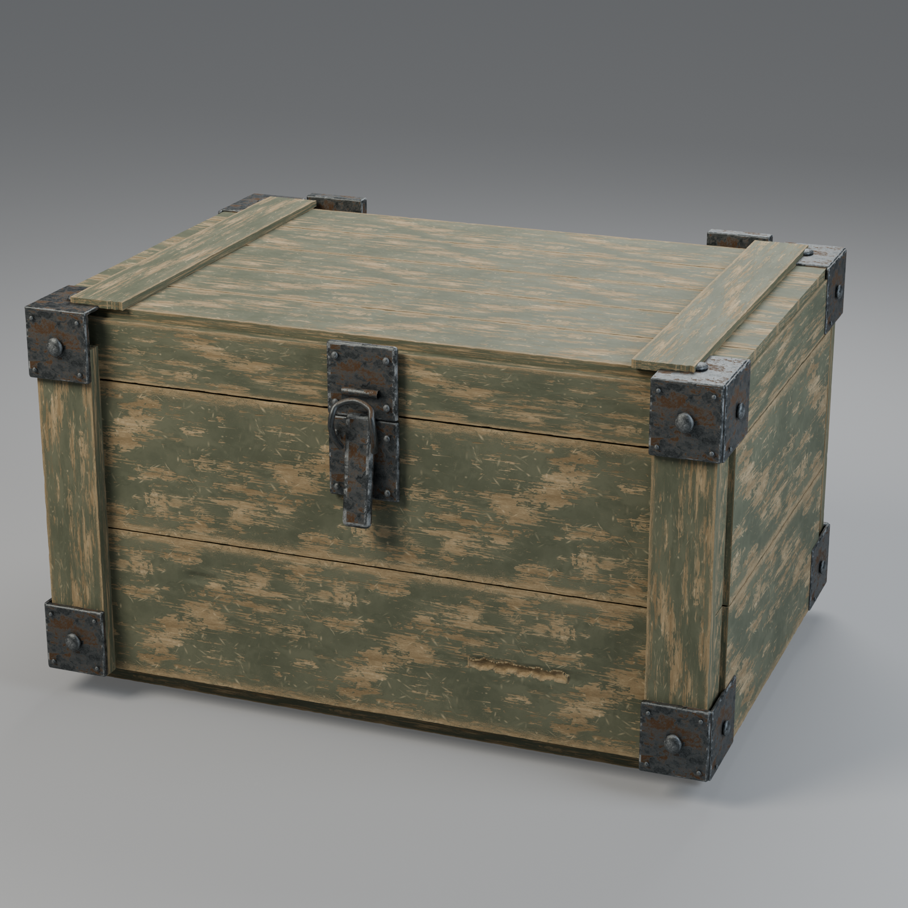
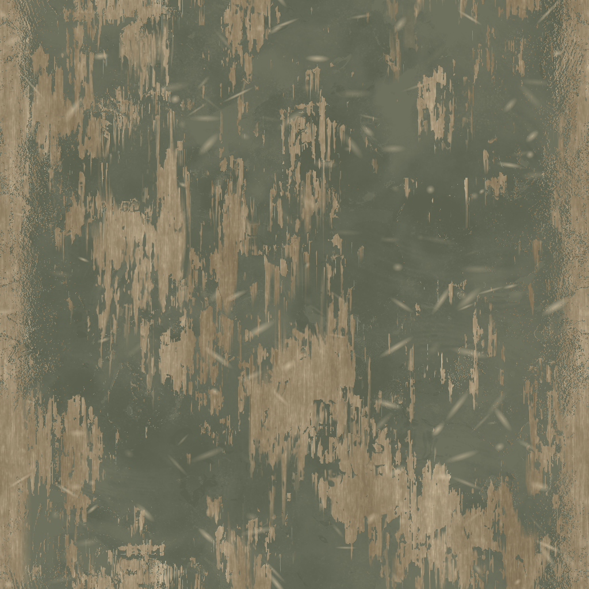
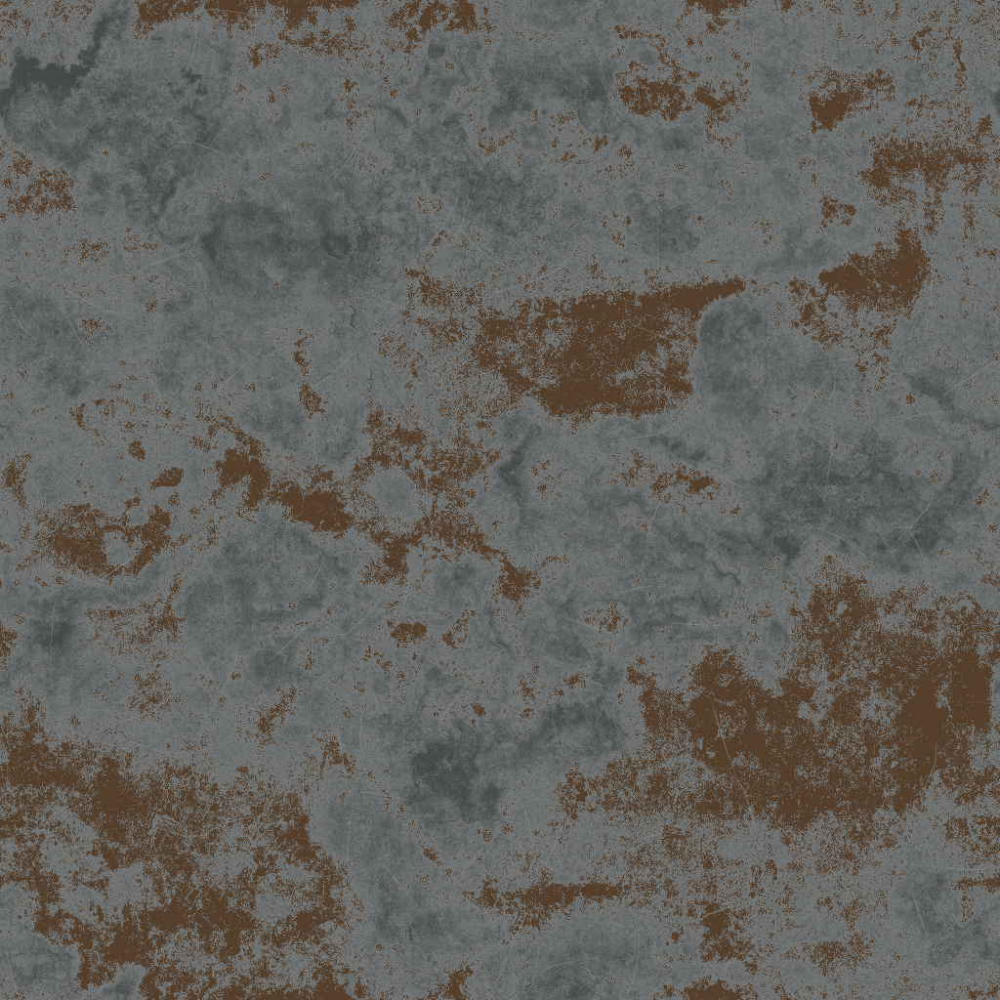
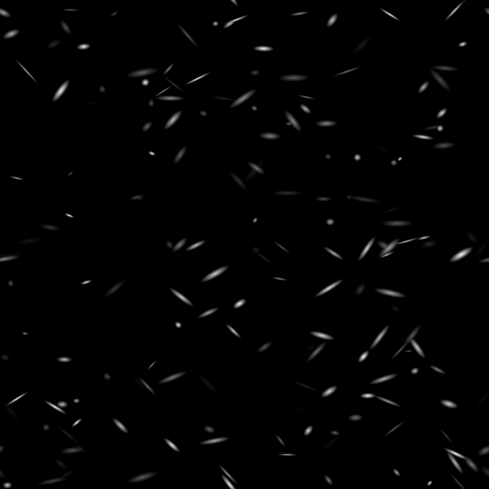
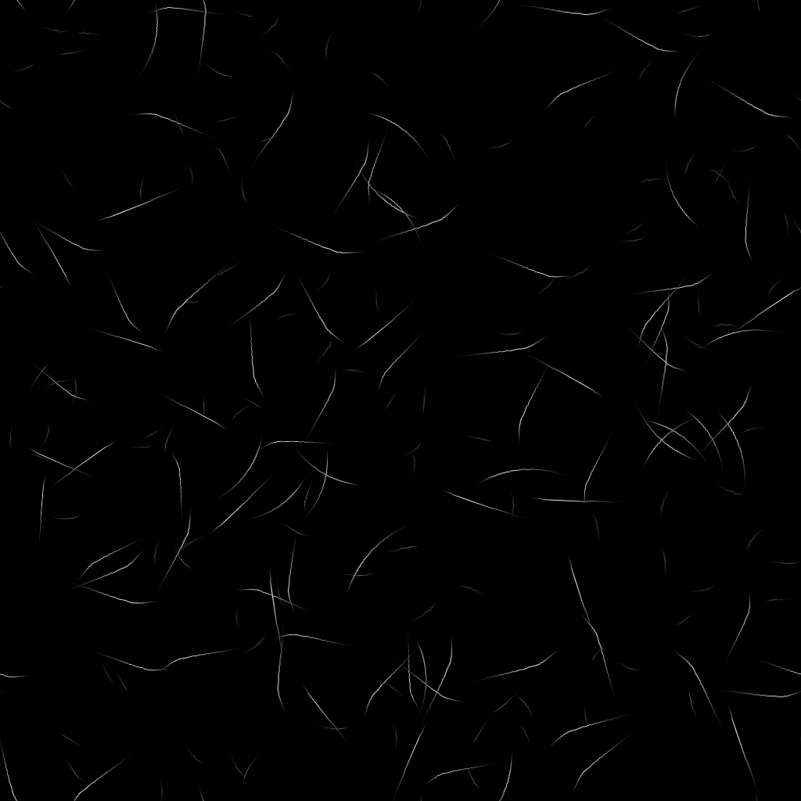
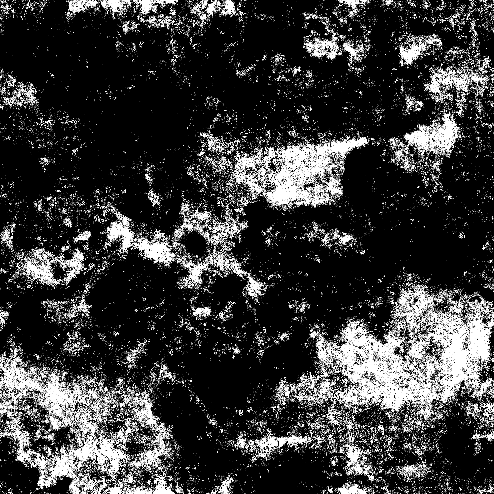
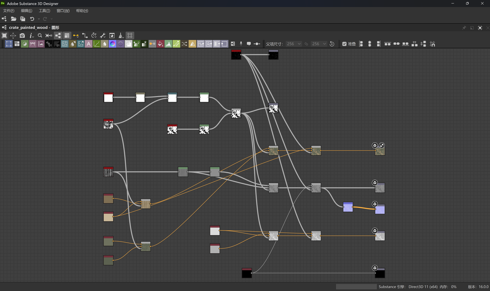
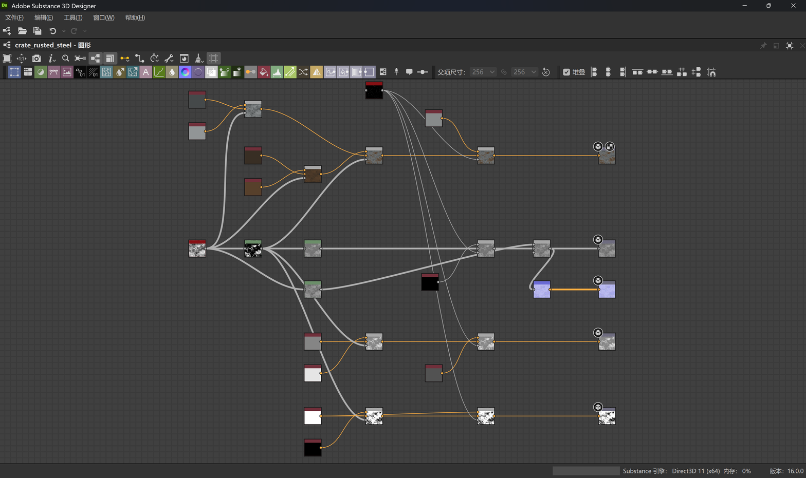

# Weathered crate: Designer materials to Blender lookdev

The [Codex-generated reference](../painted-wood/reference.png) guided a crate
modeled through DCC-MCP in Blender 5.2. The revised 2 m body uses two broad
front boards, a narrow lid rim, thin battens, tight seams, wrapped corner
plates and a curved latch. Its camera, height and depth were adjusted against
the reference. There are 119 crate meshes and one studio floor.

[Download the Blender scene](crate.blend) · [Detail render](detail.png) ·
[File hashes and channel metadata](manifest.json)

## Materials authored in Substance 3D Designer

| Painted wood | Rusted steel |
| --- | --- |
|  |  |
| [Editable SBS](wood/material.sbs) · [SBSAR](wood/material.sbsar) | [Editable SBS](steel/material.sbs) · [SBSAR](steel/material.sbsar) |

Wood Fibers and Grunge Leaky Paint establish grain and worn olive paint.
A blurred, warped Shape combines with the paint mask to expose wood along
board edges. Grunge variation breaks up the paint color. Separate height
ranges keep the paint film relatively flat and retain deeper exposed fibres;
Directional Scratches cut below both layers and feed Normal. The
`paint_coverage` input remains exposed at `0.70`.

Grunge Rust Fine provides muted rust, steel color variation and fine pitting.
Rust raises roughness and reduces metallic to zero. Scratches expose brighter
metal, lower roughness and cut into the height layer. Height blends use
grayscale inputs throughout. These details are generated in SD and exported
to Blender. Sculpted board recesses and splintered batten ends add geometry.

| Wood scratches | Metal scratches | Rust coverage |
| --- | --- | --- |
|  |  |  |

## Complete node workflows

These are unretouched DCC-CUA captures of the live Designer 16.0.0 application.
All authoring nodes and connections are visible. The internal implementations
of the referenced Adobe library resources are not expanded. The SBS files
reference the installed standard library through `sbs://`; library source
files are not redistributed.

## Maps and Blender setup

All maps are native 1024 × 1024 PNG exports. Base Color uses sRGB; Height,
Normal, Roughness and Metallic use non-color interpretation. The Blender
scene packs twelve images: ten PBR maps plus SD-derived bare-wood and worn-steel
colors for cut surfaces, bevels and rivets. All paths are relative. Its shaders
use the SD colors and metallic values; a geometry mask blends the SD painted
and bare-wood colors at the sculpted recess. Normal feeds an additional bump
contribution from Height. Each board face maps the edge-wear footprint
across its width while preserving texture density along the grain.

| Channel | Wood | Steel | Native format | Graph output |
| --- | --- | --- | --- | --- |
| Base Color | [PNG](wood/baseColor.png) | [PNG](steel/baseColor.png) | RGB8 | `output` |
| Height | [PNG](wood/height.png) | [PNG](steel/height.png) | Gray16 | `output_1` |
| Normal | [PNG](wood/normal.png) | [PNG](steel/normal.png) | RGBA16 | `output_2` |
| Roughness | [PNG](wood/roughness.png) | [PNG](steel/roughness.png) | RGB8 | `output_3` |
| Metallic | [PNG](wood/metallic.png) | [PNG](steel/metallic.png) | Gray8 / RGB8 | `output_4` |

Wood has scratch-mask and paint-mask outputs, `output_5` and `output_6`.
The steel masks and both bare-surface colors are exported from intermediate
nodes. The compiled materials retain these generic output identifiers; use
the table above when assigning channels.
Normal maps use the non-inverted Y setting in Designer. The graph was
evaluated in its legacy color workflow, with no extra export gamma transform.

Open `crate.blend` and render its active camera. The scene uses Cycles,
96 samples, denoising, AgX and three area lights. The colors, damage placement
and dimensions are artistic estimates from the lit reference. Edge wear uses
the SD board-face footprint, not a curvature bake; this is a reference-guided
lookdev study rather than a scan reconstruction.
