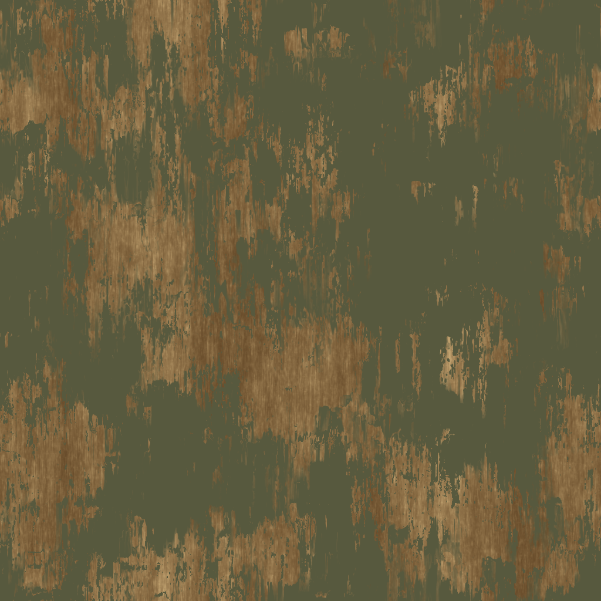
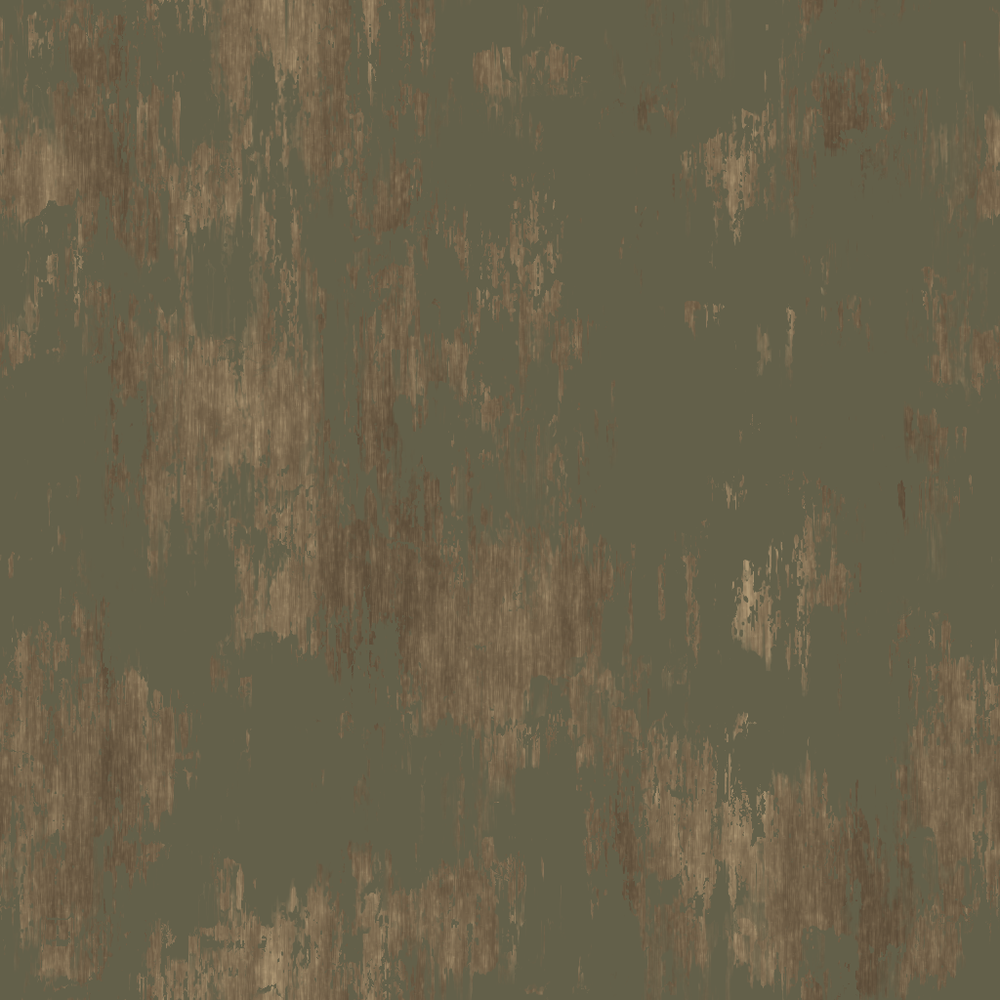
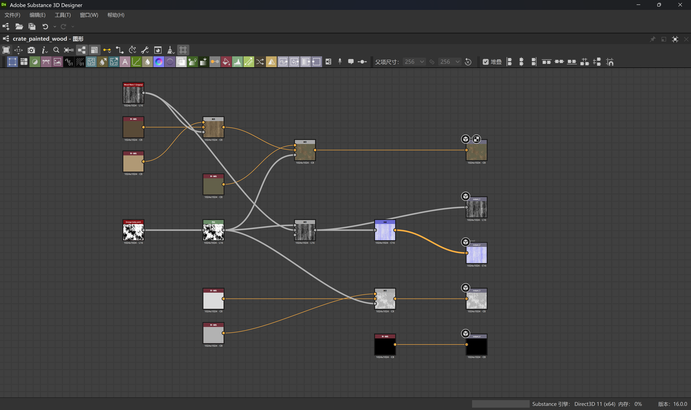
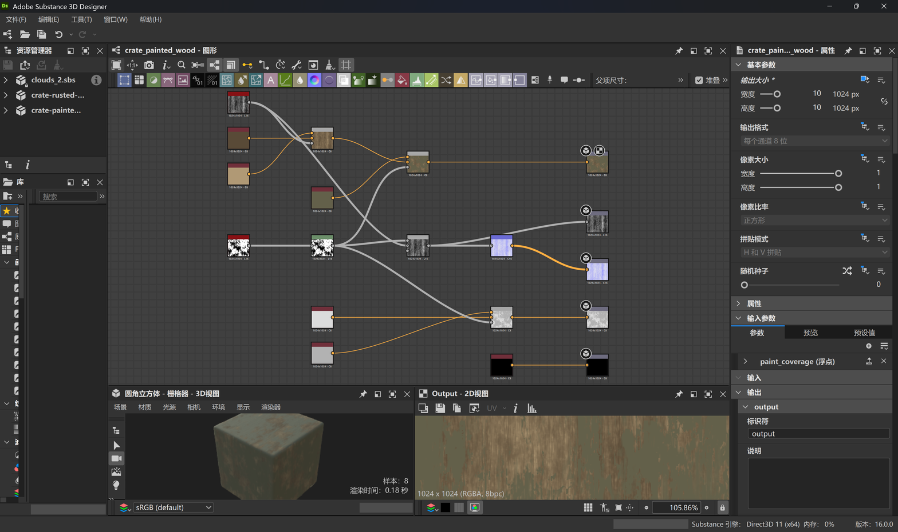

# Painted wood: generated reference to Designer material

The reference image was generated with Codex image generation. DCC-MCP then
authored an editable procedural surface in Substance 3D Designer 16.0.0 and
exported its textures from the live graph. No reference-image pixels are baked
into the graph.

## Color correction

The original paint was too green and the exposed wood too yellow. The paint
swatch changed from RGB `87, 89, 62` to `99, 96, 74`; the wood endpoints changed
from `(0.40, 0.29, 0.16)` / `(0.76, 0.64, 0.44)` to
`(0.35, 0.29, 0.215)` / `(0.69, 0.60, 0.46)`.
These are artistic estimates from the lit reference, not measured physical
albedo. Native exported paint pixels match the graph's raw normalized values.

| Before | Corrected Base Color |
| --- | --- |
|  |  |

## Complete node workflow

Wood Fibers 1 supplies grain. Two wood colors blend through the grain, then an
olive paint color blends through Grunge Leaky Paint and Levels. The same wear
mask drives roughness; grain and paint relief feed Height and Normal. Metallic
is zero. The `paint_coverage` graph input drives the paint generator's balance
through a parameter function and is saved at `0.70`.

The screenshot includes every node in this material graph. The internal graphs
of Designer's built-in Wood Fibers 1 and Grunge Leaky Paint resources are not
expanded. The SBS references those bundled resources via `sbs://`; vendor
library files are not redistributed.

## Live Designer session

Screenshots are unretouched DCC-CUA captures of Designer. The rounded cube is
Designer's material preview mesh, not the reference crate. The material has no
crate-specific edge wear, hardware, geometry or UV reconstruction.

## Files and channel interpretation

[Editable graph](painted-wood.sbs) · [Compiled material](painted-wood.sbsar) ·
[Generated reference](reference.png) · [File hashes and metadata](manifest.json)

All maps are 1024 × 1024 PNGs, generated in the live Designer session. Use sRGB
interpretation for Base Color and non-color/raw interpretation for data maps.
This graph was evaluated in Designer's legacy workflow; native export applies
no additional color transform. Do not apply a second gamma conversion.

| Map | Native graph output | PNG format | Interpretation |
| --- | --- | --- | --- |
| [Base Color](baseColor.png) | `output` | RGB, 8 bits/channel | sRGB color |
| [Height](height.png) | `output_1` | Grayscale, 16 bits/channel | Raw scalar |
| [Normal](normal.png) | `output_2` | RGBA, 16 bits/channel | Raw, tangent space; match Y convention in your renderer |
| [Roughness](roughness.png) | `output_3` | RGB, 8 bits/channel | Raw scalar; identical RGB channels |
| [Metallic](metallic.png) | `output_4` | RGB, 8 bits/channel | Raw scalar, zero |

Open the SBS in Designer 16 with its standard resource library installed.
Select `crate_painted_wood`, adjust `paint_coverage`, and compute the graph.
The compiled SBSAR exposes the same parameter. Output identifiers are listed
above because Designer retained generic names; their usage annotations carry
the PBR channel semantics.

The reference was generated in Codex; the material and map files were authored
for this repository. Adobe Substance 3D Designer is a third-party application.
